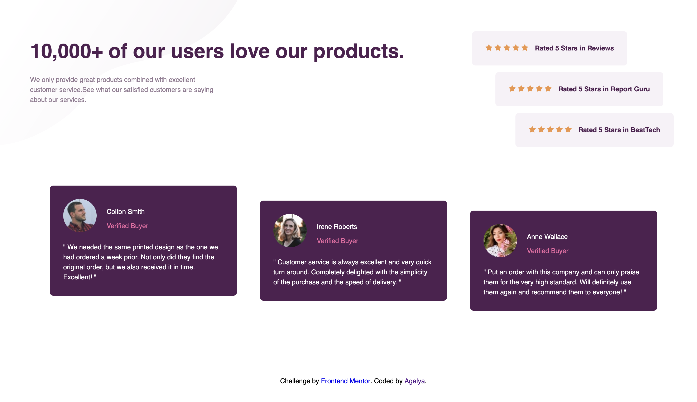

# Frontend Mentor - Social Proof Section solution

This is a solution to the [Social Proof Section challenge on Frontend Mentor](https://www.frontendmentor.io/challenges/social-proof-section-nJPrJEWEP4). Frontend Mentor challenges help you improve your coding skills by building realistic projects.

## Table of contents

- [Overview](#overview)
  - [The challenge](#the-challenge)
  - [Screenshot](#screenshot)
  - [Links](#links)
- [My process](#my-process)
  - [Built with](#built-with)
  - [What I learned](#what-i-learned)
  - [Continued development](#continued-development)
  - [Useful resources](#useful-resources)
- [Author](#author)

## Overview

### The challenge

Users should be able to:

- View the optimal layout for the component depending on their device's screen size
- See hover states for all interactive elements on the page

### Screenshot



### Links

- Solution URL: [GitHub Repo](https://github.com/Agalya141/Social_Proof_Section)
- Live Site URL: [Live Demo](https://agalya141.github.io/Social_Proof_Section/)

## My process

### Built with

- Semantic HTML5 markup
- CSS custom properties
- Flexbox
- Mobile-first workflow
- Media queries for a responsive layout

### What I learned

This project pushed me to think more carefully about how the same markup needs to adapt across breakpoints, not just visually shrink.

Getting the mobile layout right meant explicitly resetting desktop-only spacing rather than assuming it would just disappear:

```css
@media (max-width: 37.5rem) {
  .reviewer2,
  .reviewer3 {
    margin-top: 0;
  }
}
```

I also learned that a class name has to match exactly between HTML and CSS, or the rule silently does nothing — there's no error, the style just never applies:

```html
<div class="info">
  <p class="name">Colton Smith</p>
  <span class="status">Verified Buyer</span>
</div>
```

```css
.info {
  display: flex;
  flex-direction: column;
}
```

And that a `font-family` declaration in CSS is only half the job — the font itself has to be linked in the `<head>`, or the browser silently falls back to a system font:

```html
<link href="https://fonts.googleapis.com/css2?family=League+Spartan:wght@400;500;700&display=swap" rel="stylesheet">
```

### Continued development

Areas I want to keep working on in future challenges:

- Writing more reusable CSS instead of near-duplicate rules per card
- Getting comfortable with BEM naming from the start instead of retrofitting it
- Adding proper accessibility support — keyboard navigation, visible focus states, and meaningful alt text

### Useful resources

- [Frontend Mentor](https://www.frontendmentor.io) - For the challenge files and design specs.

## Author

- GitHub - [@Agalya141](https://github.com/Agalya141)
- Frontend Mentor - (https://www.frontendmentor.io/profile/Agalya141)
